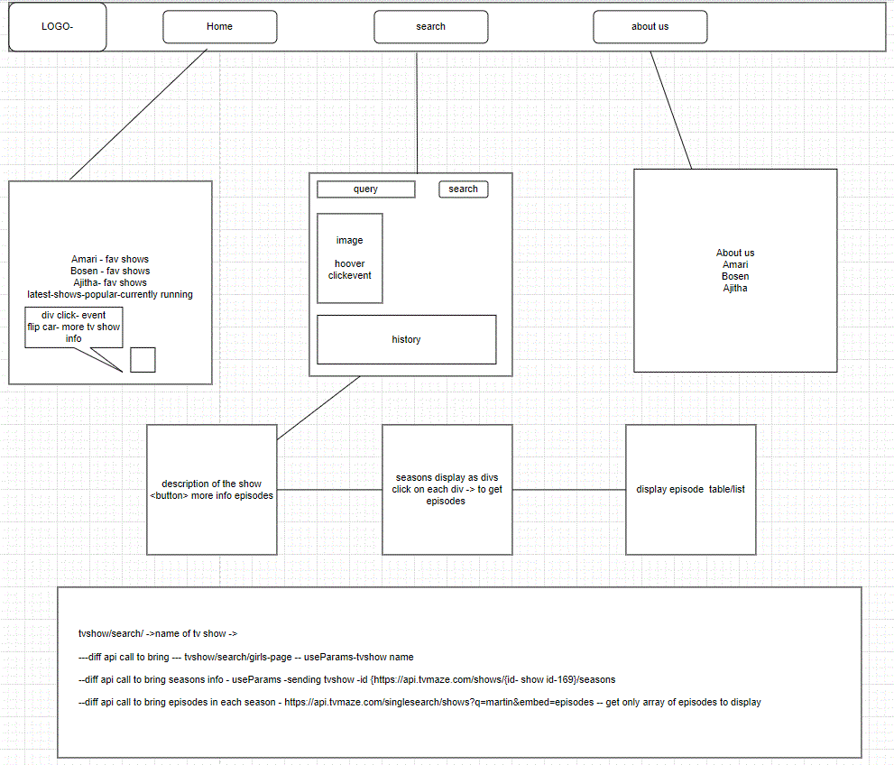

## Introduction

 TV HUB is a fully functional TV show information app with search. It was designed by our team as part of the 2022 Software Engineering Immersive cohort at Per Scholor. Our team was shown a very broken brownfield app and charged with numerous bug fixes, new features, and overhauling the design start-to-finish. <>

TV HUB is a web app for people who feel more at home looking up into the TV shows. With the newly redesigned TV HUB app, use the interactive and intuitive interface to easily search and browse through a collection of TV shows.

# TV HUB team:
Ajitha
Amari
Bosen

 
# Tech we have used: 
  <ul> React </ul>
  <ul> Axios </ul>
  <ul> Router </ul>

  <ul> sass </ul>
  
  

 
